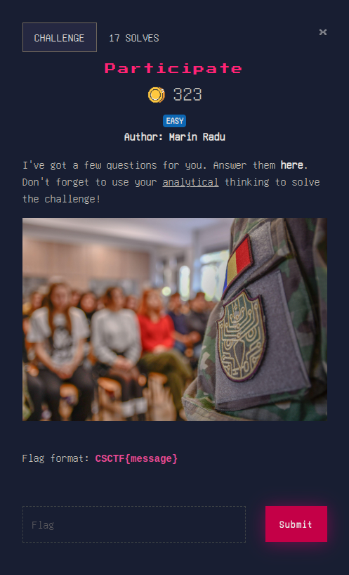
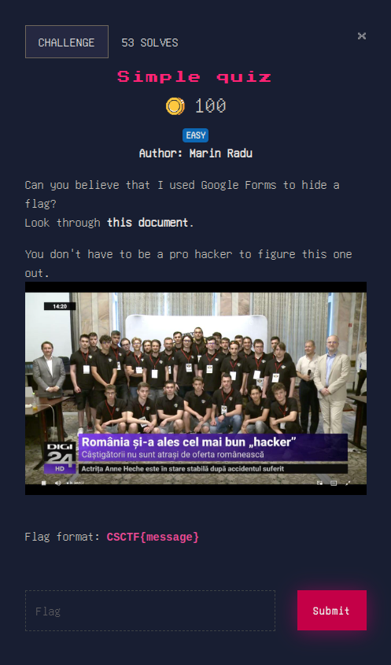
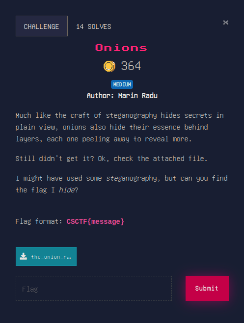
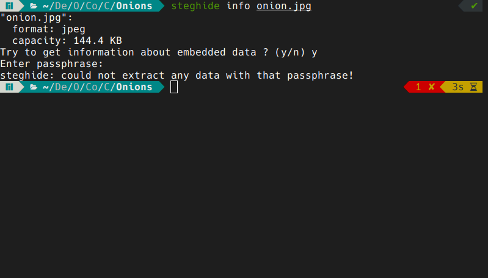
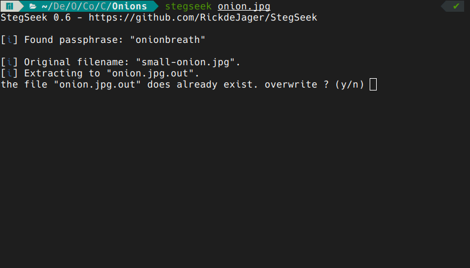

# MISC

## Participate

this is an easy solve. the link gets you to a google forms website. you simply replace the last bit of the link with `viewanalytics` and there you have the flag.

## Simple quiz

by 'looking through' this document the challenge means to inspect the actual source code. inspecting the `html` code and `Ctrl-F`-ing gets us the flag.

## Onions

this was a bit of a hassle at first, but by getting the hint from the description that he might have used some steganography we can try `steghide info` on the `onion.jpg` file. 

we can see there is some embedded data hidden in the file. running a simple `stegseek` on the picture gets us the following:

this will get us another image named `small-onion.jpg` and analyzing this picture gets us to the same conclusion. we need to run `stegseek` on it too. doing this gets us `onion.txt` which contains the flag.

that's all for for now; check out [CRYPTO](./CRYPTO)