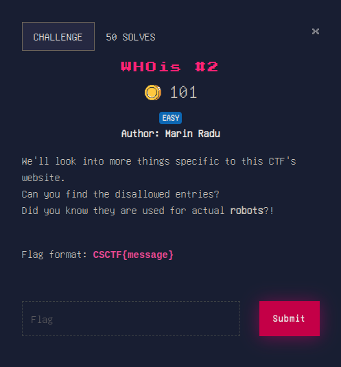

# OSINT

## WHOis #2

the solution is in the actual description of the challenge. all we have to do is visit [https://ctf.chronossec.site/robots.txt](https://ctf.chronossec.site/robots.txt) and look at the disallowed entries. there you find [https://ctf.chronossec.site/hidden-flag-that-nobody-will-find](https://ctf.chronossec.site/hidden-flag-that-nobody-will-find) and that's all.

to the next section! [MISC](./MISC)