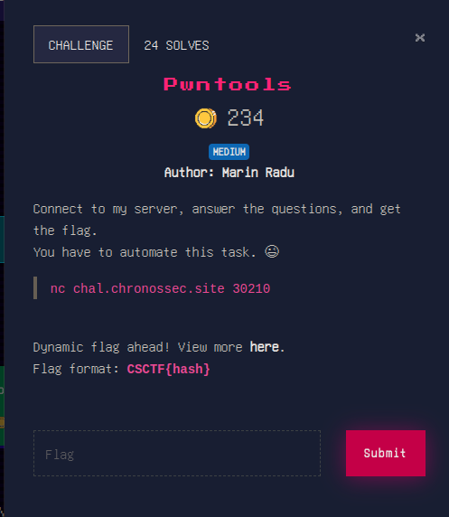
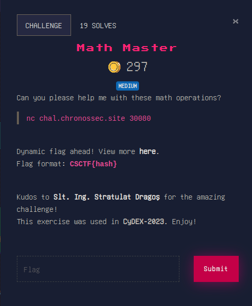
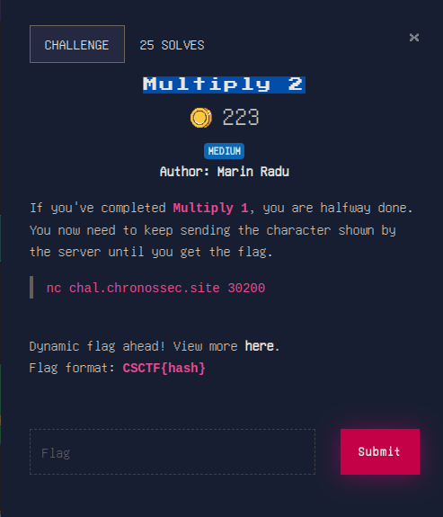
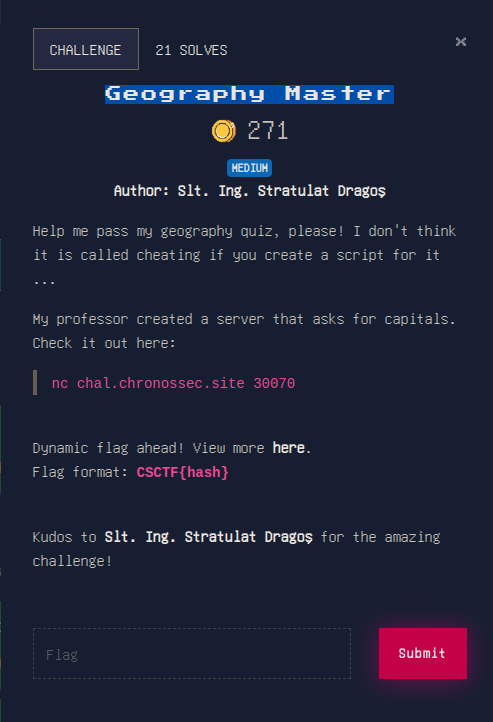

# PROGRAMMING

for this category i am only going to show the source code for each challenge as the code explains itself. i know the code could've been better written, but due to the nature of the contest i prioritized utility over readability. all things considered the code should be pretty easy to understand.

## Pwntools



```
from pwn import *
import re
import binascii

io = remote("chal.chronossec.site", 30210)

###############################################

# hex nr
resp = io.recvline()
print(resp)
resp = io.recvline()
print(resp)

io.sendline(b"python")

###############################################

# hex to ascii
resp = io.recvline()
print(resp)
resp = io.recvline()
print(resp)

io.sendline(b"pwntools")

###############################################

resp = io.recvline()
print(resp)
resp = io.recvline()
print(resp)

io.sendline(b"remote")

###############################################

resp = io.recvline()
print(resp)
resp = io.recvline()
print(resp)

io.sendline(b"recvline")

###############################################

resp = io.recvline()
print(resp)
resp = io.recvline()
print(resp)

io.sendline(b"recvuntil")

###############################################

resp = io.recvline()
print(resp)
resp = io.recvline()
print(resp)

io.sendline(b"recvall")

###############################################

resp = io.recvline()
print(resp)
resp = io.recvline()
print(resp)

io.sendline(b"context.log_level")

###############################################

resp = io.recvline()
print(resp)
resp = io.recvline()
print(resp)

io.sendline(b"sendline")

resp = io.recvline()
print(resp)
resp = io.recvline()
print(resp)

```


## Math Master



```
from pwn import *

conn = remote('chal.chronossec.site', 30080)

while True:
    text = conn.recvline().decode()
    print(text)
    input_string = text.strip()

    if input_string.startswith("Too slow"):
        print(input_string)
        break

    input_parts = input_string.split(',')

    operation = input_parts[-1]
    numbers = list(map(int, input_parts[:-1]))
    print(operation)
    print(numbers)

    if operation == 'add':
        result = sum(numbers)
    elif operation == 'subtract':
        result = numbers[0] - sum(numbers[1:])
    elif operation == 'multiply':
        result = numbers[0]
        for num in numbers[1:]:
            result *= num

    if result is not None:
        print("result of", operation, "operation:", result)

    conn.sendline((str(result)+"\n").encode())

    response = conn.recvuntil("Answer:").decode()

conn.close()

```

## Multiply 2



```
import re
from pwn import *

conn = remote('chal.chronossec.site', 30200)

while True:
    text = conn.recvline().decode()

    if not text:
        text = conn.recvall()
        print(text)
        break

    input_string = text.strip()
    print(text)

    if "Too slow" in input_string:
        print(input_string)
        break

    match = re.search(r"\[(.+?)\] exactly \[(\d+)\] times", input_string)
    if match:
        char = match.group(1)
        times = int(match.group(2))

        result = char * times

        print("Generated string:", result)

        conn.sendline(result)

conn.close()

```

## Geography Master



in this challenge i have used the data provided by [https://mledoze.github.io/countries/](https://mledoze.github.io/countries/). thanks a lot!

```
from pwn import *
import json
import re

data = None

#########################################################

def load_json_data():
    global data
    with open("countries.json", "r") as json_file:
        data = json.load(json_file)

load_json_data()

#########################################################

def search_in_data(data, search_string):
    perfect_match = None
    partial_match = None

    def search_recursive(data, search_string, current_path=""):
        nonlocal perfect_match, partial_match

        if isinstance(data, dict):
            for key, value in data.items():
                new_path = f"{current_path}.{key}" if current_path else key
                if isinstance(value, (dict, list)):
                    search_recursive(value, search_string, new_path)
                elif isinstance(value, str):
                    if search_string.lower() == value.lower():
                        perfect_match = new_path
                        return
                    elif search_string.lower() in value.lower():
                        if partial_match is None:
                            partial_match = new_path

        elif isinstance(data, list):
            for index, value in enumerate(data):
                new_path = f"{current_path}[{index}]"
                if isinstance(value, (dict, list)):
                    search_recursive(value, search_string, new_path)
                elif isinstance(value, str):
                    if search_string.lower() == value.lower():
                        perfect_match = new_path
                        return
                    elif search_string.lower() in value.lower():
                        if partial_match is None:
                            partial_match = new_path

    search_recursive(data, search_string)
    
    return perfect_match if perfect_match else partial_match

    
#########################################################

io = remote("chal.chronossec.site", 30070)

resp = io.recvlines(18)
#print(resp)

io.sendline(b"1")

resp = io.recvlines(2)
#print(resp)

for i in range(0,30):
    try:
        resp = io.recvline().decode().strip()

        pattern = r'"(.*?)"'
        matches = re.findall(pattern, resp)

        if matches:
            country = matches[0]
            print(country)

            found_paths = search_in_data(data, country)
            #print(found_paths)
            country_code = int(found_paths.split('.')[0][1:-1])
            #print(country_code)
            capital = data[country_code]["capital"][0]
            #print(capital)
            io.sendline(capital.encode())
            
            resp = io.recvline().decode().strip()
            print(resp)
            #resp = io.recvline().decode().strip()
            #print(resp)
            sleep(0.2)
            
    except EOFError:
        print("closed by remote host")
        break
        
resp = io.recvline().decode().strip()
print(resp)

io.close()
```

check out next section! [REV](./REV)