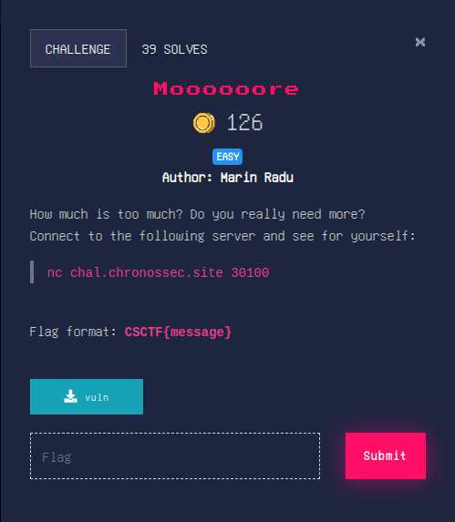
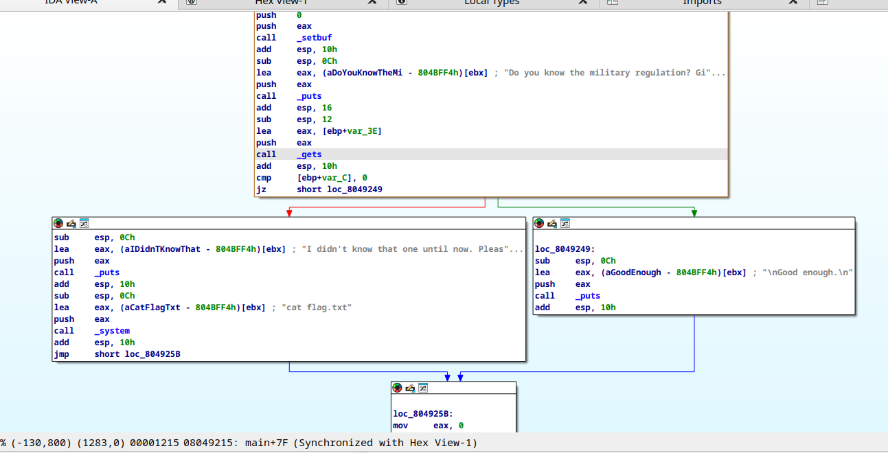
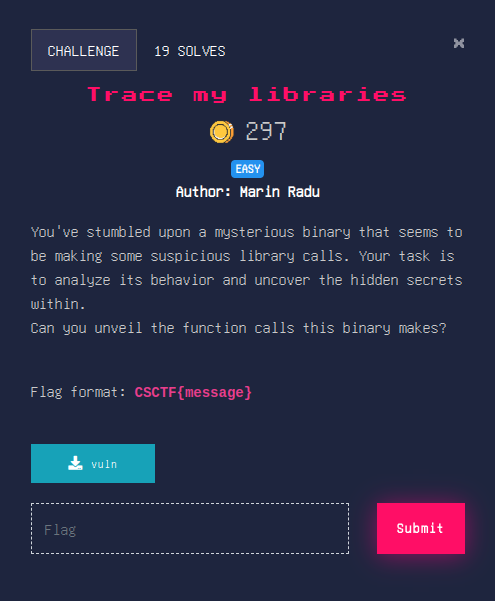
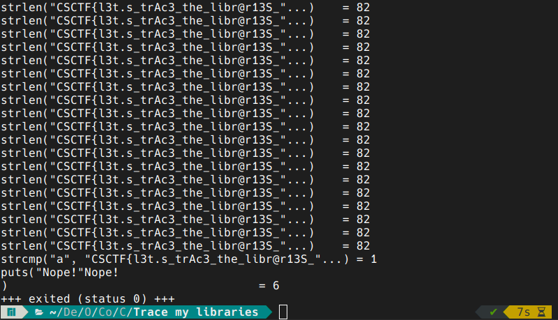
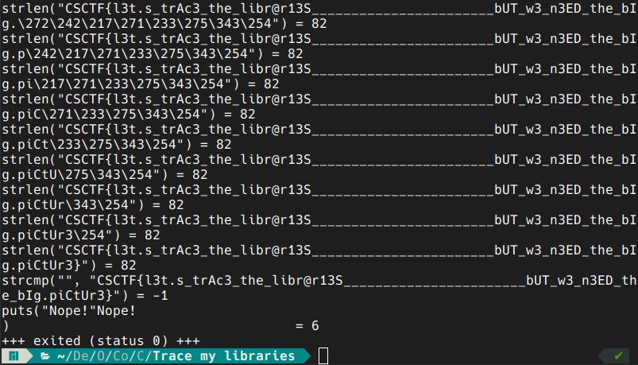

# PWN

## Moooooore

this is a classic buffer overflow attack. downloading `vuln` we can do basic inspect with IDA. 

looking at the basic program flow we can notice a couple of things:

1. we are reading from `stdin` the variable `var_3E` with the help of `gets`
2. we are checking a mysterious (for now) variable `var_C` against the value of `0`
3. if the flag is set (i.e. `var_C` is 0) then execute some code that does not help us
4. otherwise (i.e. `var_C` is not 0) then execute some code that prints out our flag.

from these things we must conclude that it is necessary to overwrite the value of `var_C` in order to get the flag.

looking at the stack of main we can notice another thing; the 'distance' between `var_3E` and `var_C` is 50 bytes. that means if we read more that 50 bytes from `stdin` then we can overwrite the value of `var_C` and thus printing the flag. we shall do just that with a simple command.

next!

## Trace my libraries

what other tool is best suited for tracing library calls? `ltrace` of course! we will do as follows:

looks like we need to see more of the flag. we can open up `man ltrace` and read about the `-s` option. we run again this time with a sufficiently big `strsize`:

voilà!

that's all for pwn... check out the next section [OSINT](./OSINT).