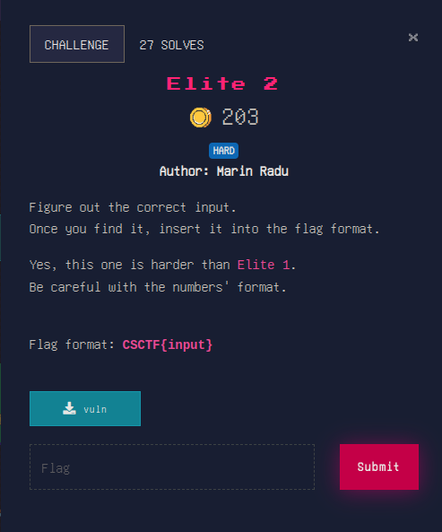

# REV

## Elite 2



all we have to do, after a bit inspection of the program flow inside of IDA, is to find `x`, where `x ` is the solution to this thing:

`x XOR b10101010(b10) = 1234567890(b10)`

and `x` is read in hex format.

thus our `x` is `1234567890(b10) XOR 10101010(b10) = 490c23c0(b16)`

inputting this gets us the flag!

```
./vuln                                       
Enter a hexadecimal number: 490c23c0
Good job! Go get your flag!
```

next section... [WINDOWS](./WINDOWS)