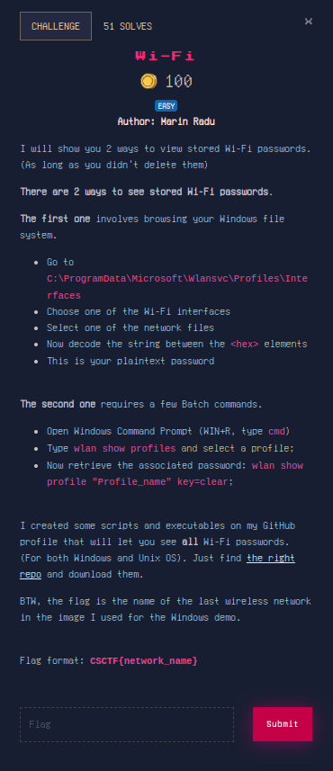

# WINDOWS

## Wi-Fi

the repo in question is [this one](https://github.com/ChronosPK/Local-WiFi-passwords)

in the image we can see the name of the last wireless network is `TP-Link_6C58_5G`.

that is the flag!

thank you for your patience! peace o/